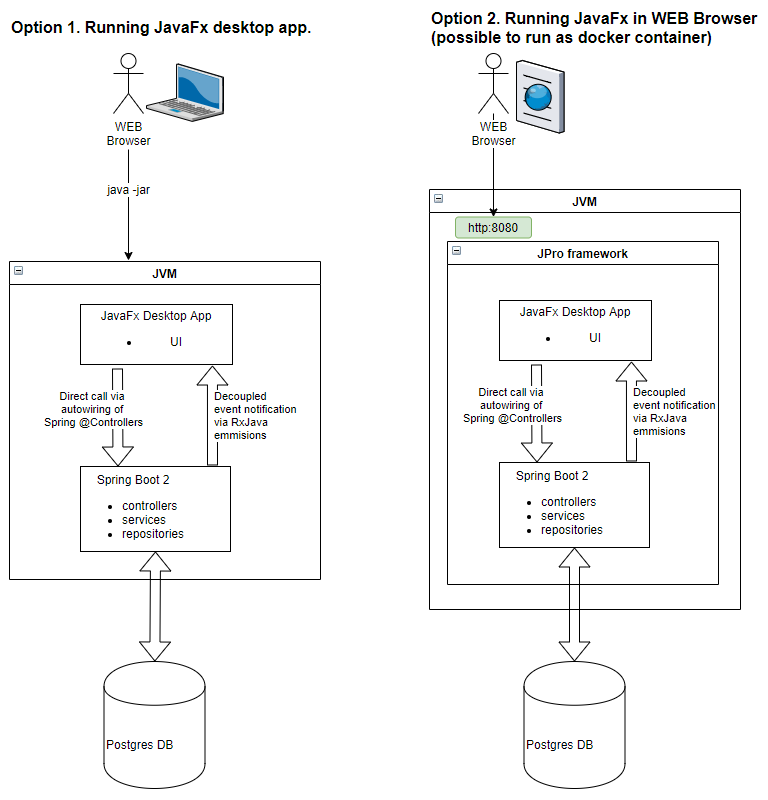
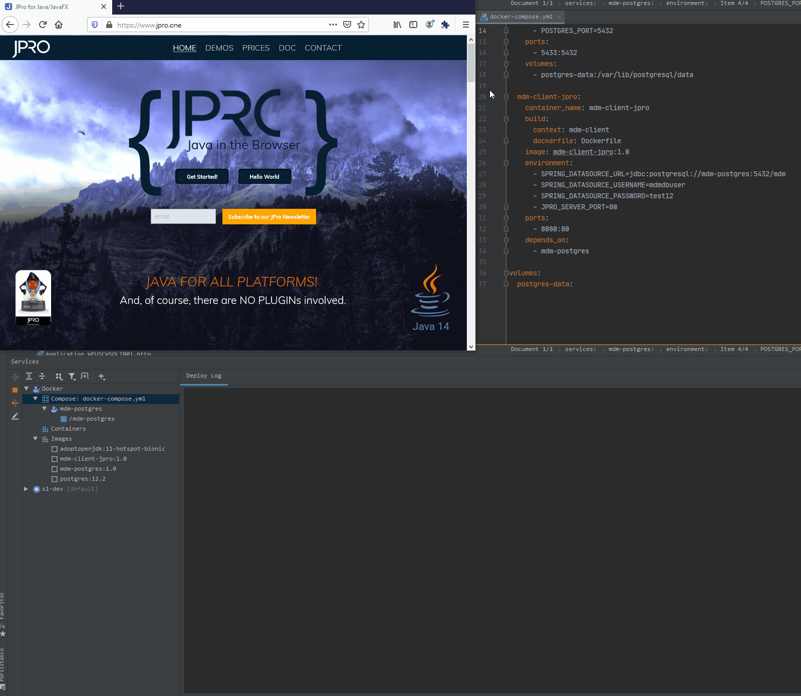
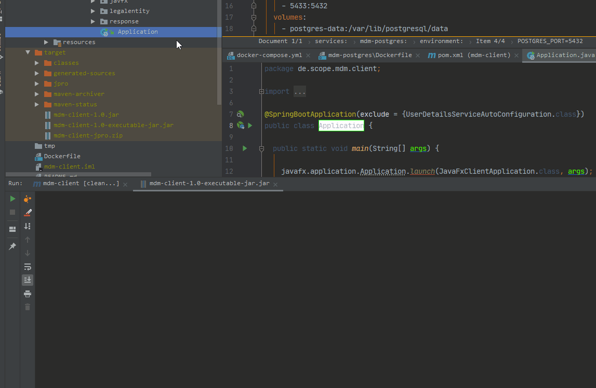

# Prototyping dockerized microservices with (JavaFX + SpringBoot + JPRO + Java 11)

* This project enables prototyping of microservices stack. 
* For ease of prototyping, JavaFx and Spring Boot framework run in the same JVM. That means that JavaFx UI and Spring Boot Server are packed in one ```mdm-client``` project (integration of JavaFx with Spring Boot beans is enabled by [FxWeaver library](https://rgielen.net/posts/2019/introducing-fxweaver-dependency-injection-support-for-javafx-and-fxml/)). In production, you can easily split into two independent modules (you can keep the Spring Boot server and you can implement UI in some popular WEB framework (and maybe even keep JavaFx Desktop application at the same time)). Splitting of modules is easy thanks to the loose coupled communication between JavaFx UI and Spring controllers. The servicese are injected into JavaFx ui as Spring beans and any events produced by Spring Services are observed and consumed in JavaFx in a reactive (decoupled) way thanks to RxJava and RxJavaFx frameworks. Both approaches enables easy split.
* Moreover, JavaFx UI is possible to run from withing WEB browser (optionally), thanks to [JPro framework](https://www.jpro.one/). This also enables to dockerize the mdm-client module, which brings another possibilities by prototyping (testing scalability, ressilience in k8S or Swarm cluster....)




## run JavaFx in web browser
* JavaFx client can run in docker container and is accessible from thanks to [JPro framework](https://www.jpro.one/)
* You can star the local docker stack by running [docker-compose.yml](docker-compose.yml). Important, you must build the mdm-client project befor starting the docker container by running ```mvn clean jpro:release``` (the dockerfile uses the generated artifacts from target folder to build the image.)
* If you refer to [Dockerfile.standalone](mdm-client/Dockerfile.standalone) if you do not want to run mvn jpro:release task before docker-compose.yaml run. The trick is, 




## run JavaFx as desktop app
* You can also run the JavaFx client as a desktop application. 
    * Either from your IDE by starting [Applicatoin.java](mdm-client/src/main/java/de/scope/mdm/client/Application.java)
    * or by running executable JAR file which you find in your target folder after execuring ```mvn clean install``` command



FYI: if you wonder what the name MDM means, then it is a shortcut for Master Data Management. As I plan to use this starter project to build more comples master data management service for my client.